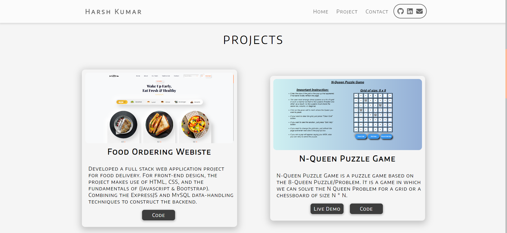
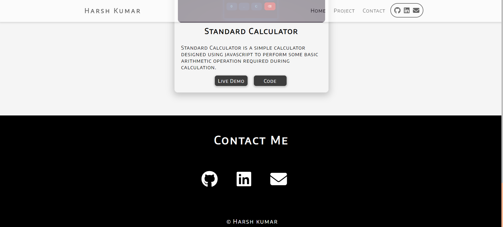
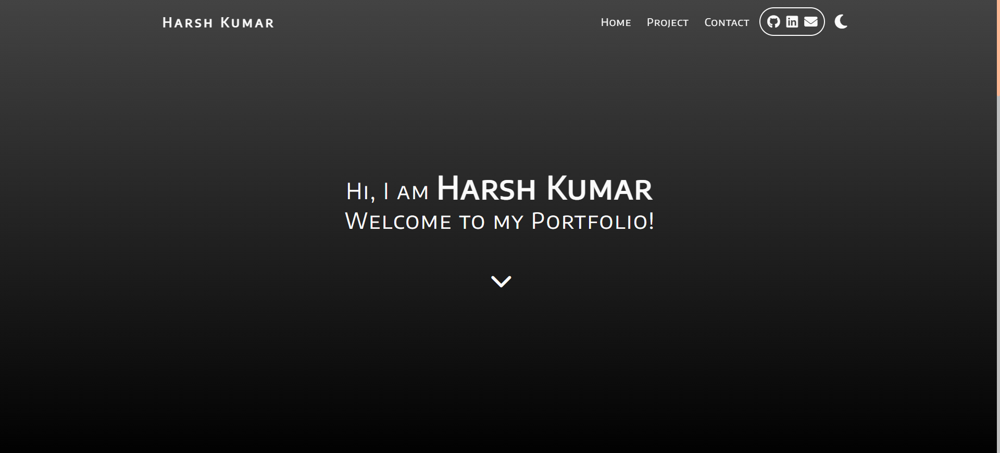
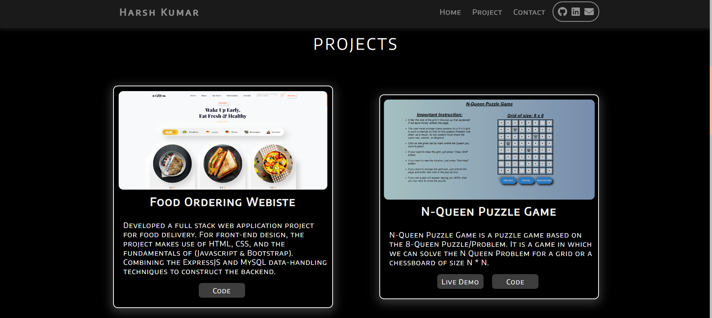

# Simple Portfolio Website
Created a simple portfolio website using HTML, CSS, JavaScript

## Features :
User Can switch to Light and Dark Mode

## Build With :
<ul>
    <li><a href="https://www.w3schools.com/html/" target="_blank">HTML</a></li>
    <li><a href="https://www.w3schools.com/css/" target="_blank">CSS</a></li>
    <li><a href="https://www.w3schools.com/js/" target="_blank">JavaScript</a></li>
</ul>

## Install and Run :
<ol>
    <li>Download the code and extract the zip file.</li>
    <li>Open the folder and double on the file named as <i>"index.html"</i> .</li>
</ol>

## Screenshot :
<ul>
    <li>Home :   </li>
    <li>Project :   </li>
    <li>Contact :   </li>
    <li>Home Dark Mode :   </li>
    <li>Project dark Mode:   </li>
</ul>
